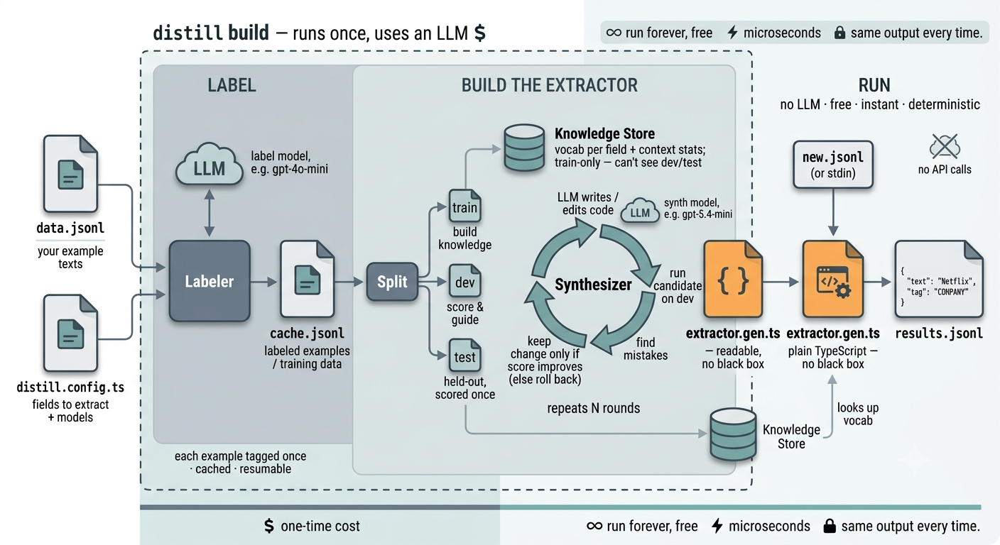

# How it works

The idea in one line: **an LLM writes an extractor program for you once, then you
run that program instead of the LLM.**

You go through three steps. The first two happen once (`distill build`). The
third is what you run in production, forever, with no LLM.



```
1. LABEL    your example texts ──▶ an LLM tags them      → training data
2. BUILD    training data ──▶ an LLM writes & tests code → extractor.gen.ts
3. RUN      new text ──▶ that code ──▶ JSON              → no LLM involved
```

Let's walk through each with a real example. Say you want to extract people,
companies, and skills from sentences like:

```
Elena Vasquez is a Staff Engineer at Netflix with 9 years in Go and Rust.
```

---

## Step 1 - Label

You provide a bunch of example sentences (`data.jsonl`). distill sends each to a
cheap LLM and asks it to tag the entities. The result is your **training data**
(saved to `cache.jsonl`):

```json
{ "input": "Elena Vasquez is a Staff Engineer at Netflix…",
  "entities": [
    { "text": "Elena Vasquez", "tag": "PERSON" },
    { "text": "Netflix",        "tag": "COMPANY" },
    { "text": "Go",             "tag": "SKILL" }
  ] }
```

This is cached, so each example is labeled only once. Re-running picks up where
it left off.

## Step 2 - Build the extractor

Now distill has examples of correct answers. It asks a second LLM to **write
TypeScript code** that reproduces them - using regular expressions, word lists,
and simple rules. Then it does something important: it **tests the code against
your examples, finds the mistakes, and asks the LLM to fix them** - repeating for
a few rounds until it stops improving.

To keep it honest, the examples are split into three groups:

- **Most of them** are used to write the code.
- **Some** are used to check progress and guide fixes.
- **The rest are hidden** and only scored at the very end - so you find out if the
  extractor truly works on text it has never seen, not just text it memorized.

The output is a readable file, `extractor.gen.ts`, that you can open and inspect.
No black box.

## Step 3 - Run

`distill run` loads that file and applies it to new text. **No LLM, no API calls
- just code.** It's fast, free, and gives the exact same answer every time.

```bash
echo '{"text":"Marcus Lee, a Backend Engineer at Shopify."}' | distill run
```
```json
{ "input": "Marcus Lee, a Backend Engineer at Shopify.",
  "entities": [
    { "text": "Marcus Lee",       "tag": "PERSON" },
    { "text": "Backend Engineer",  "tag": "ROLE" },
    { "text": "Shopify",           "tag": "COMPANY" }
  ] }
```

> Want an HTTP endpoint instead of the CLI? `distill host` serves the extractor
> over HTTP - and `distill host --learn` builds it automatically from live
> traffic. See [Hosting](hosting.md).

---

## Trying several versions at once (optional)

By default, distill builds and improves **one** extractor. You can tell it to try
**several at once** and keep the best - useful when one approach gets stuck.

Turn it on in your config:

```ts
synth: {
  population: { size: 4 },   // build & evolve 4 candidates instead of 1
}
```

With more than one candidate, distill:

- **starts each from a different strategy** (one leans on regex, one on word
  lists, one on context clues…),
- **keeps the candidates different from each other** instead of letting them all
  copy the single best one - so it always has a specialist for each field,
- **combines the best parts of two candidates** into a new one (e.g. the version
  that's best at dates merged with the one that's best at names).

This finds better extractors, especially for tricky fields - but it costs roughly
`size`× as much to build (it's calling the LLM more). Start with the default
(`size: 1`); raise it only if a field won't improve.

---

## What it's good at (and what it isn't)

**Good: structured and fixed fields.** Durations (`9 years`), degrees
(`BSc in Computer Science`), IDs, dates, and known lists (skills, companies).
Code nails these and they keep working on new text.

**Harder: open-ended, meaning-based fields.** Arbitrary person names or brand-new
job titles. Code can do well with context clues, but it can't fully match a live
LLM, because "is this a name?" is a judgment call, not a pattern. For those
fields, trying several versions helps - or you can keep using an LLM for just
those and let distill handle the rest.

**The sweet spot:** you have lots of documents and a stable set of fields. Build
the extractor once, then process everything for free.
